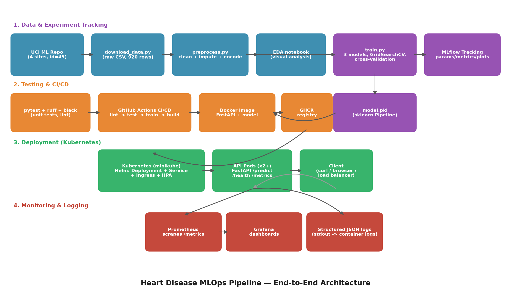

# Architecture

## 1. Data & Experiment Tracking

- **`data/download_data.py`** fetches the official UCI Heart Disease ZIP archive
  (`https://archive.ics.uci.edu/static/public/45/heart+disease.zip`) and concatenates all
  four original collection sites — Cleveland, Hungary, Switzerland, VA Long Beach — into a
  single 920-row raw CSV (`data/raw/heart_disease_raw.csv`, not committed). This is a
  deliberate deviation from the commonly distributed 303-row Cleveland-only subset; see
  [README.md](README.md#personalization--dataset-choice) for why.
- **`src/data/preprocess.py`** does leakage-free cleaning (dedup, target binarization) and
  exposes `build_preprocessor()`, a `ColumnTransformer` that is fit *only inside the model
  pipeline on the training split* — never on the full dataset before a train/test split.
- **`notebooks/01_eda.ipynb`** — executed notebook with missingness analysis, class balance,
  histograms, boxplots, categorical breakdowns, and a correlation heatmap.
- **`src/models/train.py`** — trains Logistic Regression, Random Forest, and
  HistGradientBoosting inside a single sklearn `Pipeline` (preprocessing + classifier) each,
  tuned via `GridSearchCV` over a `RepeatedStratifiedKFold` (5 splits × 2 repeats). Every run
  logs params/metrics/plots/the fitted pipeline to **MLflow** (local file-store at
  `mlruns/`). The best model by held-out ROC-AUC is refit on the full dataset and saved to
  `models/model.pkl`.

## 2. Testing & CI/CD

- **`tests/`** — pytest unit tests for preprocessing (no-NaN guarantees, dedup, missing-only
  columns), training (pipeline fit/predict, metrics), and the API (`TestClient`, valid/invalid
  payloads, `/metrics` exposition).
- **`.github/workflows/ci-cd.yml`** — three sequential jobs, each blocking the next:
  1. `lint-and-test`: `ruff`, `black --check`, `pytest` with coverage + JUnit XML artifacts.
  2. `train`: downloads data, preprocesses, trains all 3 models end-to-end on the CI runner
     (proves the pipeline is reproducible from a clean checkout), uploads `model.pkl`,
     `mlruns/`, and comparison plots as workflow artifacts.
  3. `docker-build-test`: builds the Docker image using the **freshly-trained** model
     artifact from job 2 (not the committed copy), runs the container, polls `/health`,
     smoke-tests `/predict` with a sample payload, and (on push to `main`) pushes the image
     to GHCR.
  Any failing step fails the job — no `continue-on-error`.

## 3. Deployment (Docker + Kubernetes)

- **`docker/Dockerfile`** — multi-stage build (`python:3.9-slim`), a minimal
  `requirements-api.txt` (no training-only deps), non-root user, container `HEALTHCHECK`.
- **`k8s/manifests/`** — raw Kubernetes YAML (Namespace, Deployment with readiness/liveness
  probes and Prometheus scrape annotations, ClusterIP Service, nginx Ingress, HPA).
- **`k8s/helm/heart-disease-api/`** — the same topology as a parameterized Helm chart
  (`values.yaml` controls replica count, resources, autoscaling, ingress host/annotations).
- **`scripts/deploy_minikube.sh`** — starts minikube (docker driver), enables the ingress
  addon, builds the image, `minikube image load`s it (no registry round-trip needed for
  local dev), and `helm upgrade --install`s the chart.

## 4. Monitoring & Logging

- **`src/api/main.py`** exposes `/metrics` (Prometheus exposition format) with:
  `api_requests_total{method,endpoint,http_status}`, `api_request_latency_seconds{endpoint}`,
  `predictions_total{predicted_class}`.
- **`docker/docker-compose.yml`** wires the API + Prometheus (scraping `/metrics` every 5s,
  config in `monitoring/prometheus/prometheus.yml`) + Grafana (auto-provisioned datasource +
  a dashboard with request rate, p95 latency, prediction-class mix, and status-code panels —
  see `monitoring/grafana/provisioning/`).
- Every request is also logged as a single structured JSON line to stdout
  (`src/api/logging_config.py`), which is how container/Kubernetes log aggregation would
  consume it in this project's scope (no separate log-shipping agent).
- Kubernetes pods carry `prometheus.io/scrape=true` annotations so an in-cluster Prometheus
  (not deployed here, to keep scope bounded) would pick them up automatically.
